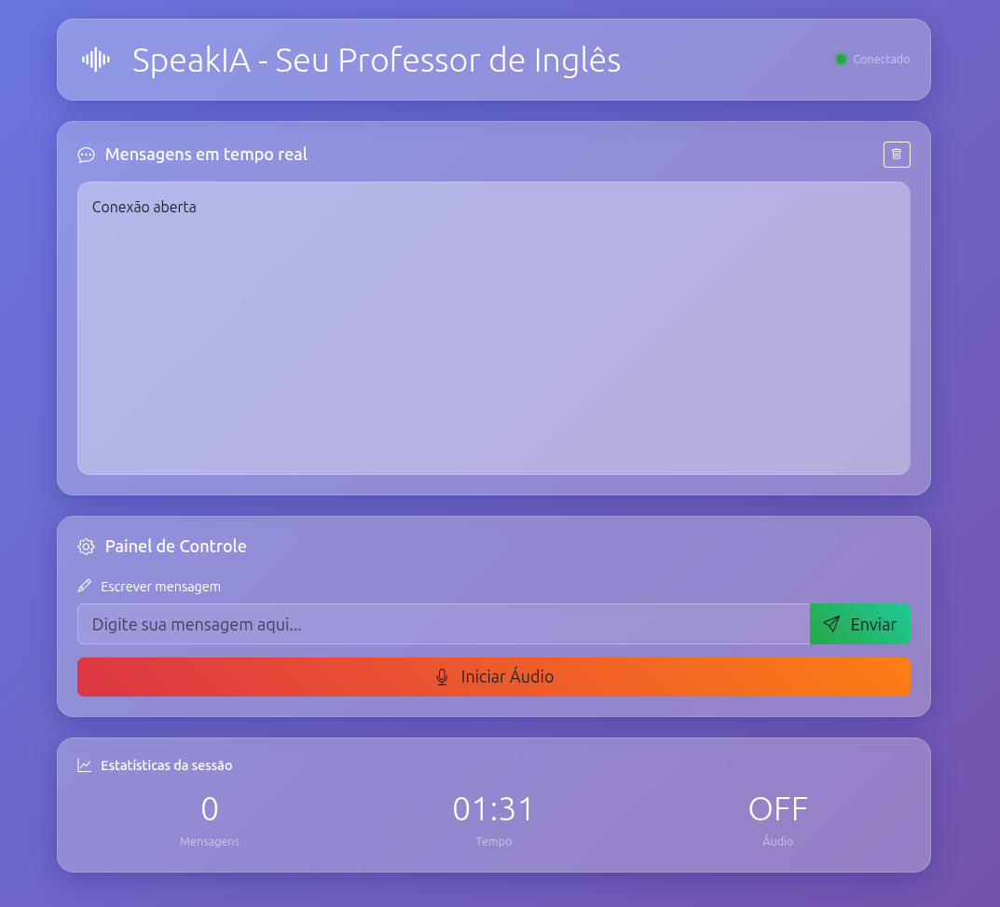

# 🤖 Assistente de  Inglês com IA

[](https://opensource.org/licenses/MIT)
[](https://www.python.org/downloads/)
[](https://fastapi.tiangolo.com/)
[](https://www.docker.com/)

## 📖 Descrição

Este é um projeto de **uso livre** que implementa um assistente de inglês personalizado potencializado por inteligência artificial. Este projeto utiliza o Google Gemini AI para criar um tutor interativo que ajuda a melhorar as habilidades em inglês através de conversas naturais em tempo real.

### ✨ Funcionalidade Principal

O assistente atua como um **professor de inglês personalizado** que:

- 🗣️ Mantém conversas naturais em inglês
- 🔍 Utiliza busca do Google para obter informações relevantes sobre tópicos de conversação
- 📝 Fornece correções e explicações em seu idioma nativo
- 🎯 Adapta o estilo de ensino conforme seu nível e necessidades
- 🎤 Suporta comunicação por voz e texto em tempo real
- 💬 Oferece um ambiente de aprendizado interativo através de WebSocket

## 🚀 Configuração Inicial

### 1. Variáveis de Ambiente

Antes de executar o projeto, você deve criar um arquivo `.env` na raiz do projeto baseado no arquivo `.env-example`:

```bash
cp .env-example .env
```

Em seguida, edite o arquivo `.env` com seus dados:

```env
GOOGLE_GENAI_USE_VERTEXAI=FALSE
GOOGLE_API_KEY="sua_google_api_key_aqui"
GOOGLE_MODEL="gemini-2.0-flash-live-001"
NATIVE_LANGUAGE="Português"
COMPLETE_NAME="Seu Nome Completo"
```

### 2. 🔑 Como Obter sua API Key do Google (Gratuita)

Para obter sua API key gratuita do Google Gemini:

1. **Visite o Google AI Studio**: Acesse [https://aistudio.google.com/](https://aistudio.google.com/)

2. **Faça Login**: Acesse com sua conta do Google

3. **Criar API Key**: 
   - Clique em "Get API Key" 
   - Selecione "Create API key"
   - Escolha "Create API key in new project" (ou selecione um projeto existente)

4. **Copie sua API Key**: Uma vez gerada, copie a chave e cole no seu arquivo `.env`

5. **Limites Gratuitos**: A versão gratuita inclui:
   - 15 solicitações por minuto
   - 1 milhão de tokens por minuto
   - 1.500 solicitações por dia

**⚠️ Importante**: Mantenha sua API key segura e nunca a suba para repositórios públicos.

## 🐳 Executar o Projeto com Docker Compose

### Pré-requisitos
- Docker
- Docker Compose

### Passos para executar:

1. **Clonar o repositório**:
   ```bash
   git clone <url-do-repositorio>
   cd my_personal_agent
   ```

2. **Configurar variáveis de ambiente** (como explicado acima):
   ```bash
   cp .env-example .env
   # Editar .env com seus dados
   ```

3. **Executar o projeto**:
   ```bash
   docker-compose up --build
   ```

4. **Acessar a aplicação**:
   - Abra seu navegador em: `http://localhost:8000`
   - A aplicação estará disponível com interface web completa

5. **Parar o projeto**:
   ```bash
   docker-compose down
   ```

## 📁 Estrutura do Projeto

```
my_personal_agent/
├── 📄 README.md                    # Documentação do projeto
├── 🐳 docker-compose.yml           # Configuração do Docker Compose
├── 🐳 Dockerfile                   # Imagem Docker da aplicação
├── ⚙️  .env-example                # Template de variáveis de ambiente
├── 📋 pyproject.toml               # Configuração e dependências Python
├── 🔒 uv.lock                      # Lock file de dependências
├── 🙈 .gitignore                   # Arquivos ignorados pelo Git
│
├── 📂 src/                         # Código fonte principal
│   ├── 🐍 main.py                  # Servidor FastAPI e WebSocket
│   ├── ⚙️  config                  # Arquivo de configuração vazio
│   │
│   ├── 📂 core/                    # Configuração central
│   │   └── 🐍 config.py            # Configuração de variáveis de ambiente
│   │
│   ├── 📂 google_search_agent/     # Agente de IA principal
│   │   ├── 🐍 __init__.py          # Inicialização do módulo
│   │   └── 🐍 agent.py             # Definição do agente professor
│   │
│   └── 📂 static/                  # Arquivos estáticos da web
│       ├── 🌐 index.html           # Interface web principal
│       ├── 📂 css/                 # Folhas de estilo
│       └── 📂 js/                  # Scripts JavaScript
│
├── 📂 .venv/                       # Ambiente virtual Python
└── 📂 .git/                        # Controle de versão Git
```

## 🖼️ Capturas de Tela

### Interface Principal

*Interface web moderna com chat em tempo real e controles de áudio*


## 🛠️ Tecnologias Utilizadas

- **Backend**: FastAPI + Python 3.13+
- **IA**: Google Gemini 2.0 Flash Live
- **Frontend**: HTML5, CSS3, JavaScript (Vanilla)
- **Comunicação**: WebSocket para tempo real
- **Contêineres**: Docker + Docker Compose
- **Estilo**: Bootstrap 5 + CSS personalizado
- **Áudio**: Web Audio API para processamento de voz

## 📝 Funcionalidades

### 🎯 Recursos Principais
- ✅ Chat em tempo real via WebSocket
- ✅ Comunicação por voz (áudio bidirecional)
- ✅ Busca do Google integrada
- ✅ Interface web responsiva
- ✅ Personalização por usuário
- ✅ Suporte ao idioma português nativo

### 🔧 Características Técnicas
- ✅ Streaming de respostas em tempo real
- ✅ Transcrição de áudio automática
- ✅ Gerenciamento de sessões por usuário
- ✅ Configuração via variáveis de ambiente
- ✅ Interface glassmorphism moderna
- ✅ Estatísticas de sessão ao vivo


## 👥 Autor

Criado com ❤️ para quem como eu tem problemas aprendizado de idiomas, e com quem praticar dia a dia.

---

⭐ Se este projeto te ajuda a aprender inglês, não esqueça de dar uma estrela!
